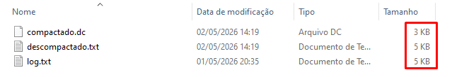

# 🌳 Huffman File Compressor
Este projeto simula um sistema de compactação e descompactação de dados utilizando o Algoritmo de Huffman.

---

<p align="center">
  <br>
  <em>Figura 1: Comparativo de tamanhos no Windows Explorer. O arquivo original (5 KB) foi reduzido para 3 KB, e posteriormente restaurado com sucesso.</em>
</p>

---

### Funcionalidades Atuais

No estágio atual de desenvolvimento, o programa opera de forma simplificada para validação da lógica de compressão:

* **Leitura de Arquivo:** O programa busca por um arquivo de entrada obrigatório nomeado como `log.txt`.
* **Mapeamento de Frequências:** Realiza a contagem de ocorrências de cada caractere.
* **Árvore de Huffman:** Construção da árvore com o algoritmo clássico de Huffman.
* **Geração de Binário:** Codifica o conteúdo e gera um arquivo de saída chamado `compactado.dc`.
* **Implementação de Cabeçalho (Header):** Adiciona a serialização da frequência dos caracteres dentro do arquivo compactado para permitir a descompressão independente.

---

### Como Rodar o Projeto

Para compilar e executar este projeto, você precisará de um ambiente com o compilador `gcc` instalado.
Abra o terminal e execute:

```bash
git clone https://github.com/DaviReder/winrar.git
cd winrar
gcc main.c -o huffman
./huffman
```

---

### Roadmap & Futuras Melhorias

As próximas melhorias lineares são:
*   **Entrada Dinâmica:** Permitir que o usuário escolha o nome do arquivo de entrada via argumentos de linha de comando.
*   **Algoritmo LZ (Lempel-Ziv):** Implementar a busca por sequências repetidas de palavras para melhorar a taxa de compressão antes da codificação de Huffman.

---

### Como funciona?

1: O programa lê o arquivo de entrada, contabiliza a ocorrência de cada caractere e armazena os valores em uma tabela.  
2: Com base na tabela, os caracteres são organizados em uma Lista Encadeada ordenada de forma crescente pela sua frequência.  
3: A lista encadeada serve de base para a construção da árvore binária, onde os pares com as menores frequências são aninhados sucessivamente até formarem uma única raiz.  
4: Cada caractere (folha) recebe uma nova representação binária baseada no seu caminho na árvore: atribuindo 0 para movimentos à esquerda e 1 para movimentos à direita.  
5: O arquivo original é reescrito utilizando esses novos códigos binários.  
O arquivo gerado contém um Header (cabeçalho) com as informações necessárias para reconstruir a árvore e permitir a descompressão posterior.  

''

>**Sobre o autor:** Estudante da **PUC/MG**.

> *O intuito deste projeto é puramente didático, servindo como base para fortificar o aprendizado em estruturas de dados complexas e otimização de software.*
*Sinta-se à vontade para explorar e sugerir melhorias!*
